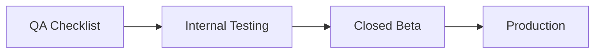

# Release Readiness

Checklists for promoting builds through **internal testing → closed beta → production**.

Related: [QA_CHECKLIST.md](./QA_CHECKLIST.md) · [INTERNAL_TESTING.md](./INTERNAL_TESTING.md) · [PRODUCTION_BLOCKERS.md](./PRODUCTION_BLOCKERS.md) · [RISK_REGISTER.md](./RISK_REGISTER.md)

---

## Release preparation flow



| Stage | Doc | Audience |
|-------|-----|----------|
| 1 | [QA_CHECKLIST.md](./QA_CHECKLIST.md) | QA / dev |
| 2 | [INTERNAL_TESTING.md](./INTERNAL_TESTING.md) | Internal testers |
| 3 | Closed beta | External testers (TestFlight / Play internal) |
| 4 | [RELEASE_READINESS.md](./RELEASE_READINESS.md) (this file) | Release manager |

---

## Before internal testing

### Environment verification

- [ ] Staging API deployed and stable (`https://.../api`)
- [ ] Staging database seeded with test products, regions, delivery areas
- [ ] `APP_ENV=staging` on all internal APKs
- [ ] `API_BASE_URL` points to staging host (not localhost)
- [ ] Documented in team wiki / release notes

### HTTPS verification

- [ ] Staging URL uses **HTTPS**
- [ ] Release APK built with staging defines (see [RELEASE_BUILDS.md](./RELEASE_BUILDS.md))
- [ ] No `http://` in staging/production release artifacts

### Sentry verification

- [ ] Staging Sentry project created
- [ ] `SENTRY_DSN` passed to internal builds (not committed to git)
- [ ] One test event received from staging build
- [ ] Privacy rules reviewed in [OBSERVABILITY.md](./OBSERVABILITY.md)

### CI verification

- [ ] [CI.md](./CI.md) workflow green on `main`
- [ ] Branch protection requires **Analyze & Test** (recommended)

### API configuration

- [ ] Payment gateway **staging** endpoints configured on backend
- [ ] CORS / mobile API auth acceptable for staging clients
- [ ] Rate limits documented for testers

### App packaging (minimum)

- [ ] Debug/staging APK installable on test devices
- [ ] Version and build number recorded (`pubspec.yaml` `1.0.0+N`)

### App icon & name

- [ ] Default Flutter icon acceptable for internal **or** custom icon applied
- [ ] App display name clear (consider “Torino Staging” when flavors added later)

### Versioning

- [ ] `version` in `pubspec.yaml` bumped for this test cycle
- [ ] `AppRelease` label in code matches (see `lib/core/observability/app_release.dart`)

### Legal (internal only)

- [ ] Privacy policy draft exists (can be staging URL)
- [ ] Terms of service draft exists (optional for internal)

### Backend health

- [ ] Health endpoint monitored
- [ ] Logs accessible for checkout/payment failures

### Database backup

- [ ] Staging DB backup policy defined (backend team)

### QA process

- [ ] [QA_CHECKLIST.md](./QA_CHECKLIST.md) assigned
- [ ] [DEVICE_TEST_MATRIX.md](./DEVICE_TEST_MATRIX.md) coverage planned

---

## Before closed beta

All **internal testing** items above, plus:

- [ ] Internal sign-off: no open S0/S1 bugs
- [ ] [QA_CHECKLIST.md](./QA_CHECKLIST.md) ≥ 90% pass rate
- [ ] Android **release signing** configured locally ([ANDROID_SIGNING.md](./ANDROID_SIGNING.md): keystore + `key.properties`)
- [ ] Play **internal testing** track **or** TestFlight external testing configured
- [ ] Beta tester invitation process documented
- [ ] Crash-free rate acceptable on staging (Sentry review)
- [ ] Arabic + English smoke on real devices
- [ ] Payment E2E verified on staging gateway (real or sandbox)
- [ ] [RISK_REGISTER.md](./RISK_REGISTER.md) reviewed; accepted risks documented
- [ ] Privacy policy URL **public** and linked in store listing draft
- [ ] Support contact email defined for beta feedback

---

## Before production

All **closed beta** items above, plus:

- [ ] Production API `https://api.YOUR-DOMAIN.com/api` verified
- [ ] `APP_ENV=prod` + production `API_BASE_URL` on store build
- [ ] Production Sentry project (separate from staging)
- [ ] **AAB** uploaded to Play production track (or iOS App Store submission)
- [ ] Store listing: screenshots, description, content rating
- [ ] Privacy policy and terms **production** URLs live
- [ ] Production payment gateway live and legally approved
- [ ] Rollback plan: previous AAB/IPA retained
- [ ] On-call / incident process for launch week
- [ ] Production DB backup and restore tested
- [ ] [PRODUCTION_BLOCKERS.md](./PRODUCTION_BLOCKERS.md) — zero open blockers
- [ ] Symbol upload for Sentry (recommended; see [OBSERVABILITY.md](./OBSERVABILITY.md))

---

## Quick reference commands

```bash
# Staging APK for internal testers
API_BASE_URL=https://staging-api.YOUR-DOMAIN.com/api \
SENTRY_DSN=https://YOUR_KEY@oORG.ingest.sentry.io/PROJECT \
./scripts/build_staging_apk.sh

# Production AAB (after all gates)
API_BASE_URL=https://api.YOUR-DOMAIN.com/api \
SENTRY_DSN=https://YOUR_PROD_KEY@oORG.ingest.sentry.io/PROJECT \
./scripts/build_prod_aab.sh
```

See [ENVIRONMENTS.md](./ENVIRONMENTS.md) and [RELEASE_BUILDS.md](./RELEASE_BUILDS.md).
